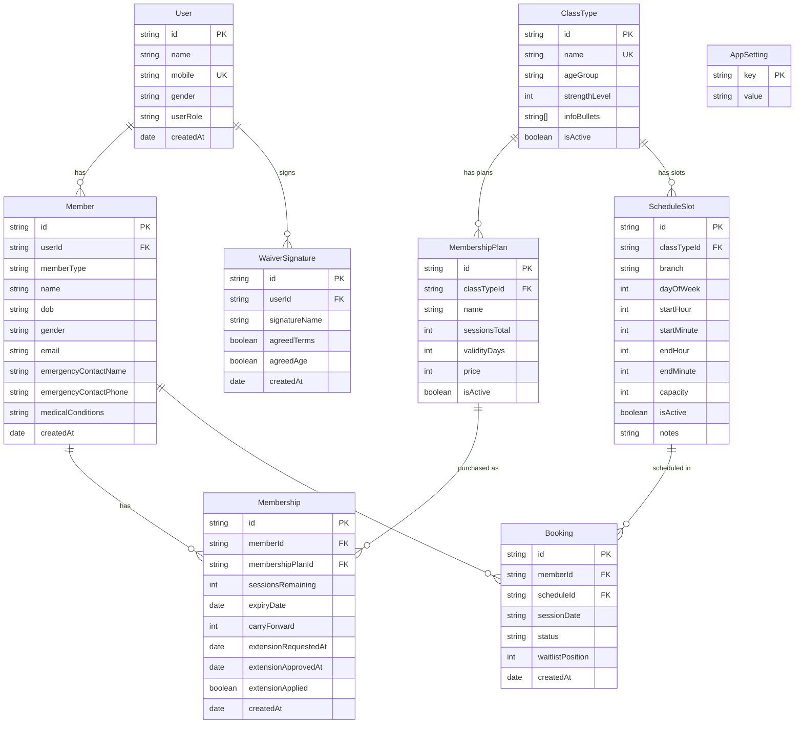

# Airborne Fitness – Entity Relationship Diagram

Mermaid ER diagram of the MongoDB/Mongoose models (matches `shared/schema.ts`).

## Relationships

| From          | To              | Cardinality | Description                                      |
|---------------|-----------------|-------------|--------------------------------------------------|
| User          | Member          | 1 : N       | One user (account) can have multiple members (e.g. Adult + Kid) |
| User          | WaiverSignature | 1 : N       | One user signs waiver(s)                          |
| ClassType     | MembershipPlan  | 1 : N       | One class type has many membership plans          |
| ClassType     | ScheduleSlot    | 1 : N       | One class type has many weekly schedule slots     |
| Member        | Membership      | 1 : N       | One member can have many memberships             |
| MembershipPlan| Membership      | 1 : N       | A plan can be purchased by many members          |
| Member        | Booking         | 1 : N       | One member can have many bookings                |
| ScheduleSlot  | Booking         | 1 : N       | One slot (per sessionDate) can have many bookings |

## Collections (MongoDB)

Mongoose model names are lowercased and pluralized:

- `users` – User
- `members` – Member
- `classtypes` – ClassType
- `membershipplans` – MembershipPlan
- `scheduleslots` – ScheduleSlot
- `memberships` – Membership
- `bookings` – Booking
- `waiversignatures` – WaiverSignature
- `appsettings` – AppSetting
